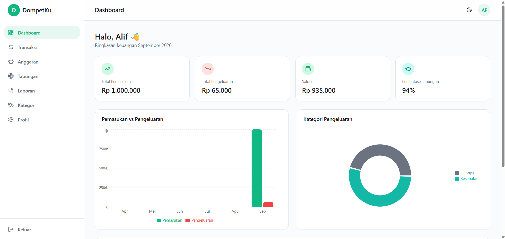

# 💚 DompetKu — Personal Finance Web App

<p align="center">
  
  
  
  
  
  
  
</p>

<p align="center">
  Full-stack personal finance tracker — transactions, monthly budgets, savings goals, and reports —
  built solo end-to-end with Next.js 15 App Router, Prisma, and Auth.js.
</p>

<p align="center">
  <a href="https://dompetku-snowy.vercel.app"><strong>🔗 Live Demo</strong></a>
  ·
  <a href="#getting-started">Getting Started</a>
  ·
  <a href="#tech-stack--architecture-decisions">Architecture Notes</a>
</p>

---

## 📸 Preview

> *(Tambahkan screenshot/GIF dashboard, transaksi, dan mode gelap di sini — simpan di `public/screenshots/` lalu referensikan seperti di bawah)*

```md



```

---

## ✨ Highlights

Project ini dibangun sebagai showcase kemampuan full-stack development modern:

- **End-to-end type safety** — dari Prisma schema → Zod validation → TypeScript types, tanpa `any` yang lolos di jalur data utama
- **Auth production-grade** — Auth.js v5 (NextAuth) dengan OAuth (Google) + Credentials provider, password di-hash dengan bcrypt, session JWT, route protection via middleware
- **Server Actions + Route Handlers** — dua pola mutasi data disediakan sekaligus (RSC-native Server Actions untuk UI internal, REST API Route Handlers untuk kebutuhan integrasi eksternal)
- **Database portability** — satu Prisma schema yang jalan di SQLite (dev) maupun PostgreSQL (production) tanpa perubahan model, dengan trade-off yang didokumentasikan (lihat bagian Architecture Notes)
- **Real data visualization** — Recharts (bar, pie, line) dikombinasikan dengan custom SVG circular progress untuk target tabungan
- **Export functionality** — CSV generation di server, PDF generation di client (jsPDF) tanpa dependency server tambahan
- **Fully responsive** — sidebar navigation di desktop, bottom navigation ala aplikasi mobile native di layar kecil
- **Dark mode** — via `next-themes` dengan CSS variables, bukan sekadar toggle class

---

## 🧩 Fitur

| Modul | Deskripsi |
|---|---|
| **Dashboard** | Ringkasan pemasukan/pengeluaran/saldo bulan berjalan, persentase tabungan, grafik bar & pie, 5 transaksi terakhir |
| **Transaksi** | CRUD lengkap — tanggal, jenis, nominal, kategori, deskripsi, metode pembayaran (Cash/Bank/E-Wallet) |
| **Kategori** | 12 kategori default Indonesia + custom kategori per user |
| **Anggaran Bulanan** | Budget per kategori dengan progress bar dinamis (hijau <70%, kuning 70–90%, merah >90%) |
| **Target Tabungan** | Circular progress, kontribusi dana bertahap, deadline opsional |
| **Laporan** | Filter hari/minggu/bulan/tahun/custom range, export CSV & PDF |
| **Profil** | Nama, foto, mata uang (IDR), mode terang/gelap |
| **Auth** | Login Google (OAuth) & Email/Password, route protection penuh |

---

## 🛠️ Tech Stack & Architecture Decisions

| Layer | Pilihan | Alasan |
|---|---|---|
| Framework | Next.js 15 (App Router) | Server Components untuk data fetching, Server Actions untuk mutasi tanpa API boilerplate |
| Bahasa | TypeScript (strict) | Type safety end-to-end |
| Styling | Tailwind CSS + komponen ala shadcn/ui | Desain konsisten, komponen dasar tetap dikontrol penuh (bukan black-box library) |
| ORM | Prisma 6 | Type-safe query builder + migration tooling |
| Database | SQLite (dev) → PostgreSQL (production) | **Trade-off yang disengaja:** skema menghindari `enum` Prisma (tidak didukung SQLite) — field seperti `type` dan `paymentMethod` disimpan sebagai `String` + divalidasi lewat Zod. Hasilnya: satu schema yang sama persis dipakai di dua database berbeda tanpa migrasi ulang model |
| Auth | Auth.js (NextAuth) v5 | Dukungan native App Router, edge middleware, kombinasi OAuth + Credentials provider dalam satu config |
| Validasi | Zod | Skema validasi tunggal dipakai ulang di client form, Server Actions, dan Route Handlers |
| Charts | Recharts | Bar (income/expense), Pie (kategori pengeluaran), Line (tren saldo) |
| Export | jsPDF + jspdf-autotable (client) / native stream (server, CSV) | Menghindari dependency server tambahan untuk generate PDF |
| Deploy | Vercel + Prisma Postgres (Marketplace) | Zero-config CI/CD dari GitHub push, database serverless-friendly |

---

## 🏗️ Struktur Folder

```
dompetku/
├─ prisma/
│  ├─ schema.prisma        # User, Category, Transaction, Budget, SavingGoal + relasi
│  └─ seed.ts               # Seed 12 kategori default Indonesia
├─ src/
│  ├─ app/
│  │  ├─ (auth)/            # login, register
│  │  ├─ (dashboard)/        # dashboard, transactions, categories, budget, savings, reports, settings
│  │  └─ api/                # Route Handlers: auth, register, transactions, categories, budgets, savings, reports/export
│  ├─ actions/                # Server Actions (mutasi via RSC)
│  ├─ components/
│  │  ├─ ui/                 # Komponen dasar ala shadcn/ui (button, dialog, select, dst)
│  │  ├─ layout/              # Sidebar, bottom-nav, topbar
│  │  └─ dashboard/, transactions/, budget/, savings/, reports/, categories/, settings/
│  ├─ lib/                    # Prisma client, Auth.js config, utils, validasi Zod
│  └─ types/                  # TypeScript types & NextAuth type augmentation
└─ .env.example
```

---

## 🚀 Getting Started

### Prasyarat
- Node.js ≥ 18.18
- npm

### Instalasi

```bash
git clone https://github.com/joketoyou24/dompetku.git
cd dompetku
npm install
cp .env.example .env

# generate AUTH_SECRET, tempel hasilnya ke .env
openssl rand -base64 32

npm run db:push
npm run db:seed
npm run dev
```

Buka [http://localhost:3000](http://localhost:3000).

### Login Google (opsional)
1. [Google Cloud Console → Credentials](https://console.cloud.google.com/apis/credentials) → buat OAuth Client (Web application)
2. Redirect URI: `http://localhost:3000/api/auth/callback/google`
3. Isi `AUTH_GOOGLE_ID` & `AUTH_GOOGLE_SECRET` di `.env`

Tanpa ini, login Email/Password tetap berfungsi normal.

### Environment Variables

| Variable | Keterangan |
|---|---|
| `DATABASE_URL` | Connection string database (`file:./dev.db` dev / PostgreSQL production) |
| `AUTH_SECRET` | Secret Auth.js — generate dengan `openssl rand -base64 32` |
| `AUTH_GOOGLE_ID` / `AUTH_GOOGLE_SECRET` | Kredensial OAuth Google (opsional) |
| `NEXT_PUBLIC_APP_URL` | URL aplikasi (untuk callback & metadata) |

### Script NPM

| Script | Keterangan |
|---|---|
| `npm run dev` | Development server |
| `npm run build` | Build production (`prisma generate` + `next build`) |
| `npm run db:push` | Sinkronkan schema ke database |
| `npm run db:seed` | Isi kategori default |
| `npm run db:studio` | Buka Prisma Studio (GUI database) |

---

## 📄 License

MIT — bebas dipakai, dimodifikasi, dan dikembangkan lebih lanjut.

## 👤 Author

**Alif**
Built solo — dari database schema design, auth flow, hingga deployment pipeline.

- Live Demo: [dompetku-snowy.vercel.app](https://dompetku-snowy.vercel.app)
- GitHub: [@joketoyou24](https://github.com/joketoyou24)

---

<p align="center">Dibuat dengan 💚 — DompetKu, atur keuangan pribadimu dengan mudah.</p>

